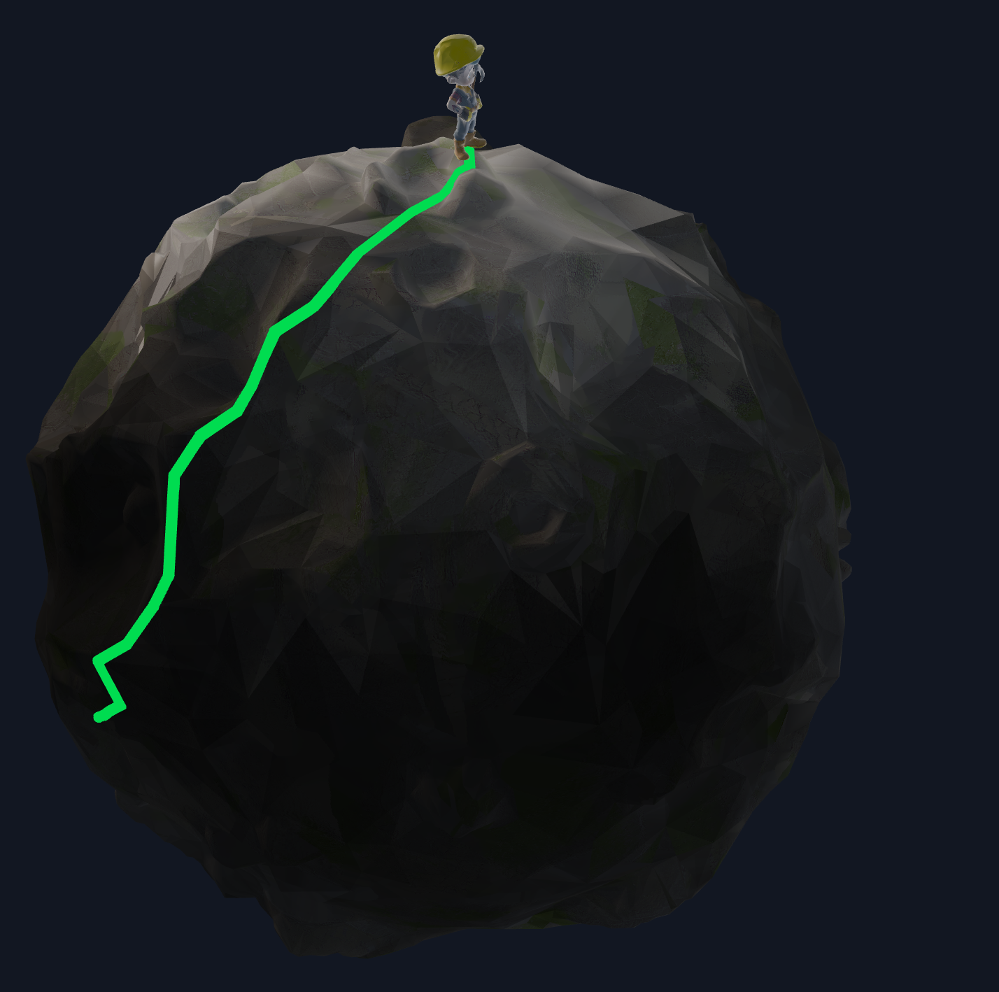

# Simplicial Spectral Bandit (C++)

<p align="center">
  Geodesic patchification + Laplace-Beltrami spectral embedding + Linear UCB for 3D mesh smart navigation
</p>

<p align="center">
  
</p>
<p align="center">
  <em>Lit regions represent recommended exploration/exploitation targets. Shadowed regions represent the rest of the mesh.</em>
</p>
<p align="center">
  Meshes used in this project were generated with <a href="https://www.meshy.ai">Meshy AI</a>.
</p>

## Why This Project
What if we adapted a spectral bandit into a **mesh spectral bandit**, where an agent learns to navigate a discretized 3D world made of thousands, or even millions, of faces?  
This project does exactly that: it combines the Laplace-Beltrami Operator (LBO), geodesic patchification, and Linear UCB to recommend geodesically relevant nodes while preserving exploration.

## Full C++ Package
This repository is intentionally **full C++** for the core pipeline and runtime using `Eigen`, `Spectra` and `raylib`

## Pipeline Overview
```text
OBJ mesh
  -> discrete geometry (M, L, graph)
  -> geodesic distances (Heat Method)
  -> geodesic patchification (FPS + Voronoi)
  -> spectral embedding (L u = lambda M u)
  -> patch contexts
  -> Linear UCB (+ optional travel cost)
  -> recommended patch + shortest path execution
  -> reward update
```

## Method

### 1) Mesh, Mass, and Cotangent Laplacian
Given a triangular mesh $\mathcal{M}=(V,F)$, the lumped mass per vertex is:

$$
m_i = \frac{1}{3}\sum_{f \ni i} A_f,
\qquad
M=\mathrm{diag}(m_1,\dots,m_n).
$$

The cotangent Laplacian is assembled with:

$$
w_{ij}=\frac{1}{2}\left(\cot \alpha_{ij}+\cot \beta_{ij}\right),
\qquad
L_{ij}=-w_{ij}\ (i\neq j),
\qquad
L_{ii}=\sum_{j\neq i} w_{ij}.
$$

This gives a sparse, symmetric discretization of the Laplace-Beltrami operator.

### 2) Geodesic Distances via Heat Method
For a source vertex $s$, solve:

$$
(M+tL)u = M\delta_s,
\qquad t \approx h^2
$$

where $h$ is the average edge length. Then compute the normalized descent field:

$$
X = -\frac{\nabla u}{\lVert \nabla u \rVert + \varepsilon}.
$$

Recover the distance potential with Poisson:

$$
(L+\varepsilon M)\phi = \mathrm{div}(X),
\qquad
d_s(i)=\phi_i-\min_k \phi_k.
$$

### 3) Geodesic Patchification
Patch centers are selected by farthest-point sampling:

$$
c_{k+1}=\arg\max_{v\in V}\ \min_{c\in C_k} d(v,c).
$$

Each vertex is assigned to its nearest center:

$$
\ell(v)=\arg\min_j d(v,c_j).
$$

Each face label is a majority vote of its 3 vertex labels.  
Each patch representative vertex is the nearest vertex to the mass-weighted centroid:

$$
\bar{x}_j=
\frac{\sum_{v\in P_j} m_v x_v}{\sum_{v\in P_j} m_v},
\qquad
\hat{c}_j=\arg\min_{v\in P_j}\|x_v-\bar{x}_j\|_2.
$$

### 4) Spectral Embedding on the Mesh
The spectral basis is computed from the generalized problem:

$$
L u_\ell = \lambda_\ell M u_\ell.
$$

After dropping the first trivial mode, each vertex gets:

$$
z_v = [u_2(v),u_3(v),\dots,u_{k+1}(v)]^\top.
$$

Patch context vectors are mass-weighted means:

$$
x_j =
\frac{\sum_{v\in P_j} m_v z_v}{\sum_{v\in P_j} m_v}.
$$

An optional bias feature appends $1$ to each context.

### 5) Decision Rule: Linear UCB on Patches
With contexts $x_j$, Linear UCB maintains:

$$
V_t=\lambda I+\sum_{\tau=1}^{t-1}x_{a_\tau}x_{a_\tau}^\top,
\qquad
b_t=\sum_{\tau=1}^{t-1}r_\tau x_{a_\tau},
\qquad
\theta_t=V_t^{-1}b_t.
$$

For each patch $j$:

$$
\mu_j = x_j^\top\theta_t,\qquad
\sigma_j = \sqrt{x_j^\top V_t^{-1}x_j},
\qquad
\mathrm{UCB}_j = \mu_j + \alpha \sigma_j.
$$

With geodesic travel cost $c_j$, final score is:

$$
\mathrm{score}_j = \mathrm{UCB}_j - \beta c_j.
$$

The selected patch is:

$$
a_t = \arg\max_j \mathrm{score}_j,
$$

then the simulator samples reward $r_t\in\{0,1\}$, runs shortest-path motion on the mesh, and updates $(V,b)$.

## Visual Modes (Viewer/Game)
| Mode | Meaning |
|---|---|
| `Texture` | raw textured mesh |
| `Exploration` | uncertainty $\sigma_j$ |
| `Exploitation` | expected reward $\mu_j$ |
| `UCB` | decision score $\mu_j + \alpha\sigma_j - \beta c_j$ |
| `Oracle` | hidden ground-truth patch probability |
| `Seen` | normalized visit count |

Shading is designed as **shadow -> illuminated**: low values remain dark, high values become bright.

## Build

### Prerequisites
- CMake `>= 3.20`
- C++20 compiler (`clang++` or `g++`)
- OpenGL-capable environment for viewer/game modes

### Configure and compile
```bash
cmake -S . -B build -DSB_BUILD_VIEWER=ON -DSB_BUILD_TESTS=ON
cmake --build build -j
```

### C++-only headless build
```bash
cmake -S . -B build -DSB_BUILD_VIEWER=OFF -DSB_BUILD_TESTS=ON
cmake --build build -j
```

## Usage

### 1) CLI simulation
```bash
./build/spectral_bandit_cpp simulate --steps 30
```

### 2) Interactive game/viewer
```bash
./build/spectral_bandit_cpp game --mesh planet/planet_texture.obj --patches 160
```

### 3) 3D player mesh mode
```bash
./build/spectral_bandit_cpp game3d \
  --mesh planet/planet_texture.obj \
  --player-mesh player/player_texture.obj \
  --patches 160
```

### 4) Render all heatmaps to PNG
```bash
./build/spectral_bandit_cpp render --steps-before-render 20 --out-dir outputs_cpp
```

### Main options
- `--mesh <path>`
- `--patches <int>`
- `--dim <int>`
- `--alpha <float>`
- `--lam <float>`
- `--beta <float>`
- `--seed <int>`
- `--no-bias`

## Controls (Game)
- Left click on planet: select patch
- Left click + drag (outside panel): orbit camera
- Mouse wheel: zoom
- UI panel buttons: run bandit step, mine selected patch, auto modes, speed, heatmap modes
- `ESC`: quit

## Tests
```bash
ctest --test-dir build --output-on-failure
```

or:

```bash
./build/sb_tests
```

## Project Layout
```text
include/spectral_bandit/   # public C++ headers
src/                       # core C++ implementation
tests_cpp/                 # C++ tests
planet/, player/, images/  # assets
```

## Reproducibility Notes
- The simulator seeds RNG through `--seed`.
- Hidden reward maps are sparse with local geodesic hotspots to stress exploration/exploitation.
- The full mesh is always rendered; patchification is conceptual for decision-making and visualization.
